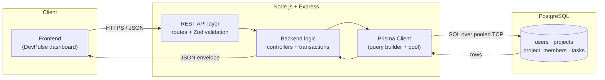
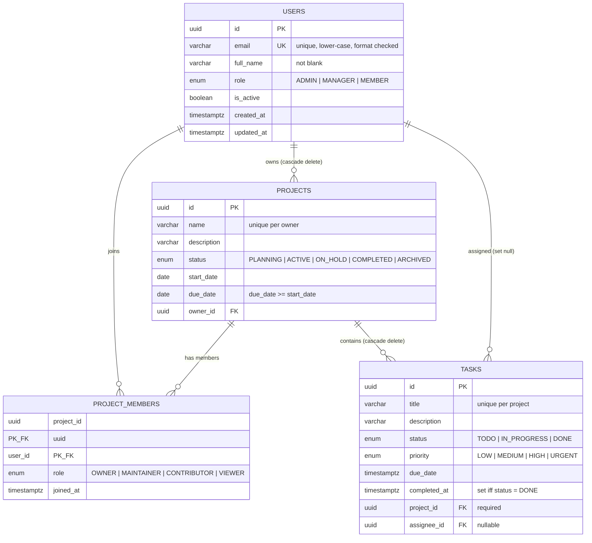

# Architecture

## Request flow



Every request passes through four checkpoints:

| Layer | Responsibility | What it rejects |
|---|---|---|
| Routes | Method, path, param shape | Unknown routes (404), malformed UUIDs |
| Validation (Zod) | Types, lengths, enums, cross-field rules | Bad payloads (422) with per-field messages |
| Controllers | Business rules, transactions | Cross-row rules, e.g. assignee must be a project member (400) |
| PostgreSQL | NOT NULL, UNIQUE, FK, enum types, CHECK | Anything the layers above missed (409 / 422 via the error mapper) |

The last row is the important one. The database enforces integrity even if a
query arrives from psql, a migration script, or a future service — not just
from this API.

## Entity relationships



### Why the delete rules differ

- **User → Project: CASCADE.** A project with no owner is meaningless, so
  deleting the owner removes their projects (and, transitively, those
  projects' tasks).
- **Project → Task: CASCADE.** A task cannot exist outside a project; the
  `project_id` column is `NOT NULL`.
- **User → Task (assignee): SET NULL.** Work outlives the person assigned to
  it. Removing a user un-assigns their tasks rather than deleting history.
- **Project ↔ User membership: CASCADE on both sides.** A membership row is
  meaningless once either side is gone.

## Configuration and secrets

```
.env            ->  git-ignored, holds the real DATABASE_URL
.env.example    ->  committed, placeholder values only
src/config/env  ->  validates every variable at boot, exits on failure
```

No credential appears in source, in `docker-compose.yml`, or in any log line.
Error responses never echo the connection string, and stack traces are
suppressed when `NODE_ENV=production`.
